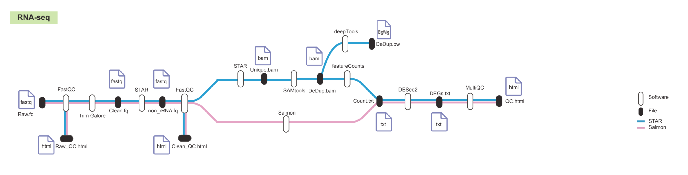

# RNA-seq Pipeline

This is a unified, automated RNA-seq pipeline designed to run a complete analysis from raw FASTQ files to differential expression results. It leverages Singularity for reproducibility and is capable of batch processing multiple samples.

## Workflow Diagram


## Features

-   **Single Command Execution**: Runs the entire workflow, including per-sample processing and final DEG analysis, with one command.
-   **Two Modes**: Supports both alignment-based (`align`) and alignment-free (`quant`) workflows.
    -   **`align` mode**: STAR -> samtools -> featureCounts -> DESeq2. Generates BAM, BigWig, and count files.
    -   **`quant` mode**: Salmon -> DESeq2. Generates transcript quantifications.
-   **Reproducible**: All software is encapsulated within a Singularity container (`RNA.sif`).

## Requirements

1.  **Singularity**: Must be installed on your system.
2.  **Pipeline Files**:
    -   `run_pipeline.sh`
    -   `RNA.sif` (the Singularity container)
    -   Place both files in the same directory.
3.  **Reference Data**: A directory containing all necessary reference files (STAR indices, Salmon index, GTF annotation, etc.).

## Setup

### 1. Prepare the Sample Sheet

This is the most critical input file. Create a CSV file named `samplesheet.csv`.

-   `sample`: A unique identifier for the sample (e.g., `Control_Rep1`). This name will be used for output subdirectories.
-   `condition`: The experimental group for the sample (e.g., `Control`, `Treated`). This is used for the DESeq2 design.
-   `fastq1_path`: The **absolute path** to the Read 1 FASTQ file.
-   `fastq2_path`: The **absolute path** to the Read 2 FASTQ file.

**Example `samplesheet.csv`:**

```csv
sample,condition,fastq1_path,fastq2_path
Control_Rep1,Control,/path/to/data/Control_Rep1_R1.fastq.gz,/path/to/data/Control_Rep1_R2.fastq.gz
Control_Rep2,Control,/path/to/data/Control_Rep2_R1.fastq.gz,/path/to/data/Control_Rep2_R2.fastq.gz
Treated_Rep1,Treated,/path/to/data/Treated_Rep1_R1.fastq.gz,/path/to/data/Treated_Rep1_R2.fastq.gz
Treated_Rep2,Treated,/path/to/data/Treated_Rep2_R1.fastq.gz,/path/to/data/Treated_Rep2_R2.fastq.gz
````

### 2\. Prepare the Reference Genome

You have two options to get the required reference genome data.

#### Option A: Download Pre-built Indices (Recommended)

For convenience, we provide a pre-packaged archive containing all necessary Human (hg38) indices and annotation files.

```bash
Download the pre-built hg38 reference package
wget ...
```

This will create a `reference_data` directory with the following required structure:

```
reference_data/
├── annotation.gtf
├── t2g.tsv #t2g.tsv is a two-column mapping file required for DESeq2 analysis when using Salmon quantification.
├── star_genome_index/
├── star_rrna_index/
└── salmon_index/
```

#### Option B: Build Indices Manually

If you need to use a different genome or wish to build the indices yourself.


## Usage

Execute the pipeline using a single command, providing the sample sheet, output directory, reference directory, and desired mode.

**Example for `align` mode:**

```bash
./run_pipeline.sh \
  -s ./samplesheet.csv \
  -o ./project_results \
  -r ./reference_data \
  -m align \
  -L Control \
  -t 8
```

**Example for `quant` mode:**

Note the additional `-g` flag, which is required for this mode to provide the transcript-to-gene mapping file.

```bash
./run_pipeline.sh \
  -s ./samplesheet.csv \
  -o ./project_results \
  -r ./reference_data \
  -m quant \
  -g ./reference_data/t2g.tsv \
  -L Control \
  -t 8
```

## Output Structure

After the pipeline completes, the output directory (`./project_results` in the examples above) will be organized as follows:

```
./project_results/
├── Control_Rep1/
│   ├── Control_Rep1.bw                # (align mode) BigWig signal track
│   ├── Control_Rep1.counts.txt        # (align mode) Raw gene counts for this sample
│   ├── Control_Rep1.dedup.bam         # (align mode) Final processed BAM file
│   └── ... (other intermediate files, QC reports, and logs)
├── Control_Rep2/
│   └── ... (files for the next sample)
├── Treated_Rep1/
│   └── ... (files for the next sample)
├── multiqc_report/
│   └── multiqc_report.html            # Final, aggregated QC report for all samples
├── deg_results.txt                    # Final differential expression gene list from DESeq2
└── normalized_counts.csv              # Normalized counts matrix from DESeq2
```
